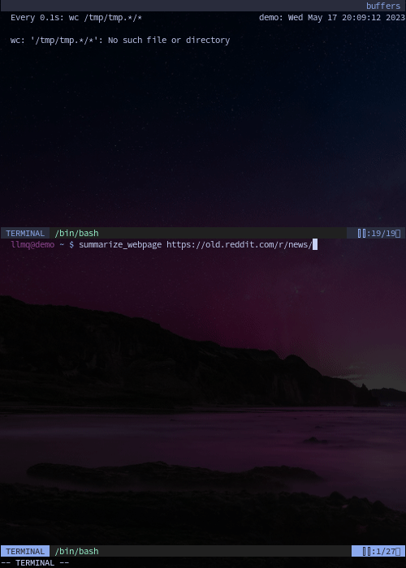

```
oooo  oooo
`888  `888
 888   888  ooo. .oo.  .oo.    .ooooo oo
 888   888  `888P"Y88bP"Y88b  d88' `888
 888   888   888   888   888  888   888
o888o o888o o888o o888o o888o `V8bod888
┌─────────────────────────────────┐ 888
│ a query CLI and context manager │ 888.
│ for LLM-powered shell pipelines │ 8P'
└─────────────────────────────────┘ "
```

### Contents

- [Synopsis](#synopsis)
- [Plugins](#plugins)
- [Installation](#installation)
- [Examples](#examples)
- [Demonstration](#demonstration)
- [Contributing](#contributing)
- [AGPL Notice](#agpl_notice)

## <a name=synopsis>SYNOPSIS</a>

```
usage: llmq [-hv] [ACTION] CTXPATH                [OPTS]... [--] [MSGS... | -]
       llmq [-hv] [ACTION] PLUG[://[~][NAMEDCTX]] [OPTS]... [--] [MSGS... | -]
       llmq [-hv] [ACTION] -                      [OPTS]... [--] [MSGS]...
```

The `llmq` executable is a terminal-friendly wrapper for large language models that:

- Reads command-line arguments and/or input from stdin
- Handles file I/O efficiently by writing deltas
- Performs HTTPS GET or POST requests using cURL
- Stores credentials in restrictive files
- Parses YAML quickly using rapidyaml

llmq is built around plugins, which are designed to be easy to create.  
See the [plugins](#plugins) section for guidelines.

Plugins Included:
- `gpt`: an llmq plugin for the OpenAI Chat Completions endpoint.

#### Plugin Directories

- `$LLMQ_STORAGE_DIR` (or `~/.llmq`)
  - base directory for persistent context storage
- `$LLMQ_TEMP_DIR` (or `/tmp/llmq`)
  - base directory for temporary context storage
- `$LLMQ_CONFIG_DIR` (or `$XDG_CONFIG_HOME/llmq` or `~/.config/llmq`)
  - base directory for authentication and other configuration files

Files and directories are automatically created/populated if they do not exist.

#### llmq Flags

- `-h --help` prints help documentation and exits
  - if neither `ACTION` nor `PLUG`/`CTXPATH` are specified, prints llmq help
  - if `ACTION` is specified but `PLUG`/`CTXPATH` is not, prints `ACTION` help
  - if `PLUG`/`CTXPATH` is specified, prints plugin help
- `-v --verbose` prints debugging information to stderr

_note: llmq flags cannot be overridden by plugins and may be used anywhere before '--'._

### ACTION

`i init`: (re-)initializes a context file WITHOUT making a query
```
usage: llmq [-hv] init PLUG://[~][NAMEDCTX] [OPTS]... [--] [MSGS]...
       llmq [-hv] init CTXPATH              [OPTS]... [--] [MSGS]...

llmq i gpt://  -m gpt-4 "hi!" # prints /tmp/llmq/gpt/<...>.yml
llmq i gpt://~ -m gpt-4 "hi!" # same as above; unnamed init always creates new temporary
llmq i gpt://foo              # prints nothing (note: gpt has no defaults)
llmq i myctx.yml              # initializes a local YAML file
```

`n new`: initializes a new a temporary context file
```
usage: llmq [-hv] new PLUG [OPTS]... [--] [MSGS]...

llmq n gpt -m gpt-4 "hi!" # prints /tmp/llmq/gpt/<...>.yml
```

`q query`: queries the endpoint and prints reply without modifying context
```
usage: llmq [-hv] query PLUG[://[~]NAMEDCTX] [OPTS]... [--] [MSGS... | -]
       llmq [-hv] query -                    [OPTS]... [--] [MSGS]...

llmq q gpt://query "hi!"
llmq q gpt -m gpt-4 -T 1.0 --stream=true --system "sysmsg" "usrmsg"

ctx=`llmq n gpt --model gpt-4`
cat `ctx`  | llmq q --stream 1 "hi!"
echo "hi!" | llmq q $ctx --stream 1 # same as above
```

`c chat`: queries the endpoint, prints reply, and modifies context
```
usage: llmq [-hv] chat PLUG://[~]NAMEDCTX [OPTS]... [--] [MSGS... | -]
       llmq [-hv] chat CTXPATH            [OPTS]... [--] [MSGS... | -]

llmq chat gpt://chat "hey!"
echo "listen!" | llmq chat gpt://chat
```

`u update`: same as chat, but does not print reply
```
usage: llmq [-hv] update PLUG://[~]NAMEDCTX [OPTS]... [--] [MSGS... | -]
       llmq [-hv] update CTXPATH            [OPTS]... [--] [MSGS... | -]

llmq update gpt://chat "foo"
echo "bar" | llmq update gpt://chat
```

`p plugins`: lists registered plugins
```
usage: llmq [-hv] plugins

llmq p # gpt : an llmq plugin for the OpenAI Chat Completions endpoint.
```

`l locate`: converts `PLUG[://[~][NAMEDCTX]]` to `CTXPATH`
```
usage: llmq [-hv] locate PLUG[://[~][NAMEDCTX]]

llmq l gpt           # /home/user/.llmq/gpt/
llmq l gpt://~       # /tmp/llmq/gpt/
llmq l gpt://~foo    # /tmp/llmq/gpt/foo.yml
llmq l gpt://foo/bar # /home/user/.llmq/gpt/foo/bar.yml
```

`L unlocate`: converts `CTXPATH` to `PLUG://[~][NAMEDCTX]`
```
usage: llmq [-hv] unlocate CTXPATH

llmq L /home/user/.llmq/gpt/ # gpt:// # note: uses qualified name
cd ~/.llmq/gpt; llmq L .     # gpt://
llmq L ~/.llmq/gpt/foo.yml   # gpt://foo
llmq L /tmp/llmq/gpt/        # gpt://~
llmq L /tmp/llmq/gpt/bar.yml # gpt://~bar
```

`f find`: finds context files
```
usage: llmq [-hv] find PLUG[://[~][NAMEDCTX]]
       llmq [-hv] find

llmq f            # find $LLMQ_STORAGE_DIR $LLMQ_TEMP_DIR -type f -name '*.yml'
llmq f gpt        # find `llmq l gpt` -type f -name '*.yml'
llmq f gpt://~foo # find `llmq l gpt://~foo` -type f -name '*.yml'
```

`a auth`: opens $EDITOR at authfile
```
usage: llmq [-hv] auth PLUG[://[~][NAMEDCTX]]

llmq a gpt        # cd $LLMQ_CONF_DIR; $EDITOR gpt/.auth
llmq a gpt://~foo # same as above- works as long as plugin can be determined
```

`e edit`: opens $EDITOR at ctxfile
```
usage: llmq [-hv] edit PLUG://[~][NAMEDCTX]
       llmq [-hv] edit CTXPATH

llmq e gpt://query    # cd `llmq l gpt://`  && $EDITOR query.yml
llmq e gpt://~foo/bar # cd `llmq l gpt://~` && $EDITOR foo/bar.yml
llmq e ./test.yml     # $EDITOR ./test.yml
```

`d del`: deletes a single context file
```
usage: llmq [-hv] del PLUG://[~][NAMEDCTX]
       llmq [-hv] del CTXPATH

llmq d gpt://unneeded # rm -f /tmp/llmq/gpt/unneeded.yml
```

`m meta`: prints llmq metadata as JSON
```
usage: llmq [-hv] meta PLUG://[~][NAMEDCTX]
       llmq [-hv] meta [CTXPATH | -]

echo '--- !plugin gpt' | llmq meta # { plugin: "gpt" }
```

`k kill`: kills an ongoing operation
```
usage: llmq [-hv] kill PLUG://[~][NAMEDCTX]
       llmq [-hv] kill CTXPATH

llmq k gpt://      # kills all ongoing gpt operations
llmq k gpt://query # kills operation on named context
llmq k foo.yml     # kills operation on CTXPATH
```

### PLUGIN

The name of the target plugin.

### CONTEXT

A YAML-encoded query/chat context file (e.g. model parameters, messages).
CONTEXT omits the ".yml" suffix present on all context files.
If CONTEXT begins with '~', it is stored in the temp directory.

### OPTIONS

Named arguments or flags to pass to the plugin.

"--" may be used to indicate the end of OPTIONS and the start of MSGS.

### MSGS

Positional plugin arguments. These are typically messages, but can be any
positional argument supported by the plugin. If ACTION is query or chat
(and -i is not used), llmq reads stdin into one MSG.

## <a name=plugins>Plugins</a>

llmq is built around plugins, which are compiled into the executable.

To register a plugin, derive `llmq::plugin` in `plugins/*.cc` an create a static/inline instance.

```cpp
// base class for plugins. create a static instance to register it with the executable.
struct plugin {
	struct arg {
		int         name;  // shortopt char or longopt val, 0 if unnamed
		std::string value; // empty if no value (flag)
	};

	// name of the plugin. called before init.
	[[nodiscard]] virtual std::string_view name() const noexcept = 0;

	// path to the plugin configuration directory. called before init.
	// if not overridden (or empty), uses $XDG_CONFIG_HOME/llmq/PLUGIN
	// (or ~/.config/llmq/PLUGIN if XDG_CONFIG_HOME is not found).
	// the confdir will be created if not found.
	[[nodiscard]] virtual std::filesystem::path confdir() const noexcept;

	// path to the plugin context storage. called before init.
	// if not overridden (or empty), uses $XDG_DATA_HOME/llmq/PLUGIN
	// (or ~/.local/share/llmq/PLUGIN if XDG_DATA_HOME is not found).
	// the datadir will be created if not found.
	[[nodiscard]] virtual std::filesystem::path datadir() const noexcept;

	// path to the temporary plugin context storage. called before init.
	// if not overridden (or empty), uses /tmp/llmq/PLUGIN.
	// the tmpdir will be created if not found.
	[[nodiscard]] virtual std::filesystem::path tmpdir() const noexcept;

	// getopt shortopts. empty string_view disables shortopts. called before init.
	[[nodiscard]] virtual std::string_view shortopts() const noexcept;

	// getopt longopts. nullptr disables longopts. called before init.
	[[nodiscard]] virtual option const* longopts() const noexcept;

	// provides the help string. called before init.
	[[nodiscard]] virtual std::string_view help() const noexcept = 0;

	// the plugin usage statement. called before init.
	[[nodiscard]] virtual std::string_view usage() const noexcept = 0;

	// a short one-line description of the plugin. called before init.
	[[nodiscard]] virtual std::string_view descr() const noexcept = 0;

	// registers the plugin. instances must be static.
	plugin(std::source_location loc = std::source_location::current()) noexcept;
	plugin(plugin const&)            = delete;
	plugin(plugin&&)                 = delete;
	plugin& operator=(plugin const&) = delete;
	plugin& operator=(plugin&&)      = delete;
	virtual ~plugin()                = default;

	// initialize the plugin with the context tree, plugin args, and authfile data.
	// guaranteed to be called before context, url, headers, post, and onreply.
	virtual void init(ryml::Tree context, std::span<arg const> args, std::string auth) = 0;

	// provides the current, updated context.
	[[nodiscard]] virtual ryml::Tree const& context() const = 0;

	// provides the endpoint URL.
	[[nodiscard]] virtual std::string_view url() const = 0;

	// appends the request headers.
	virtual void append_headers(std::function<void(std::string_view)> append) const = 0;

	// computes the postdata. if not overridden (or nullopt), llmq uses GET instead.
	[[nodiscard]] virtual std::optional<std::string_view> post() const;

	// integrate a reply into the context.
	// onreply should print content if print is true (if applicable).
	virtual void onreply(std::string_view reply, bool print) = 0;

	// called when the response has completed. prints a newline by default (if print).
	virtual void onfinish(bool print);
};
```

See `plugins/gpt.{h,cc}` for an example.

- `make` compiles all plugins into an executable.
- `*.mk` files in the `plugins/` directory may add targets and modify variables, e.g.:
```
.o/plugins/myplug.o: CXXFLAGS += $(shell pkg-config --cflags somepkg)
LDFLAGS += $(shell pkg-config --libs somepkg)
```

See [contributing](#contributing) if you want to add a plugin to the library.

## <a name=installation>Installation</a>

### Dependencies

- GNU/Linux
- pkg-config
- C++20
- libcurl
- _rapidyaml 0.5.0 is embedded with exceptions enabled_

### Setup

```
git clone https://github.com/jpcx/llmq.git
cd llmq
make
make install # sudo or root
```

## <a name=examples>Examples</a>

In the `examples/` folder, you will find several examples of bash scripts that
use llmq within bash pipelines.

- `cmd`: generates and executes a bash command on the system based on user input. uses GPT-3.5 for interpreting and GPT-4 for generating.
- `codegen`: generates a single function in a programming language. uses GPT-3.5 to produce 3 alternatives and GPT-4 to review the proposed solutions and produce the actual result.
- `introspection`: allows GPT-3.5 to have a conversation with itself about anything.
- `scmd`: same as cmd, but uses an additional GPT-3.5 layer and modified prompts to prevent the script from executing anything that would modify the system in any way.
- `selftest`: given a lesson plan, GPT-4 acts as a professor and quizzes GPT-3.5 about the topic.
- `summarize`: iteratively splits the input into chunks, summarizes each with GPT-3.5, combines their summaries, and repeats until the output is enough for a final GPT-3.5 summary.
- `summarize_webpage`: calls summarize with the result of curl and html2text.

## <a name=demonstration>Demonstration</a>

A demonstration of the original motivation behind this tool (generic editor integration).

- `llmq e gpt://demo` opens a new context in NeoVim for editing.
- `:call timer_start(300, {-> nvim_command('sil! checktime')}, {'repeat': -1})` enables autorefresh.
- Live edits provide parameters and user messages.
- `:sil! !llmq -iq c gpt://demo &` starts the request and (quietly) updates the context.
- `:sil! !llmq k gpt://demo` kills the process.


An illustration of the potential for complex interactions between LLMs and the system.

- See `examples/cmd`


An interesting dialogue between two LLMs.

- See `examples/selftest`


A simple implementation of web summaries using GPT-3.5.

- See `examples/summarize_webpage`



## <a name=contributing>Contributing</a>

If you have implemented a plugin for another language model, please make a pull request!
I want to avoid including plugins that can be replicated using prompts and piping alone,
but core language model API clients are more than welcome. Please use the provided
`.clang-format` for formatting, and embed any dependencies in the `3rdparty/` folder.

## <a name=agpl_notice>AGPL Notice</a>

```
Copyright (C) 2023 Justin Collier <m@jpcx.dev>

  This program is free software: you can redistribute it and/or modify
  it under the terms of the GNU Affero General Public License as
  published by the Free Software Foundation, either version 3 of the
  License, or (at your option) any later version.

  This program is distributed in the hope that it will be useful,
  but WITHOUT ANY WARRANTY; without even the implied warranty of
  MERCHANTABILITY or FITNESS FOR A PARTICULAR PURPOSE.  See the
  GNU Affero General Public License for more details.

You should have received a copy of the GNU Affero General Public License
along with this program.  If not, see <https://www.gnu.org/licenses/>.
